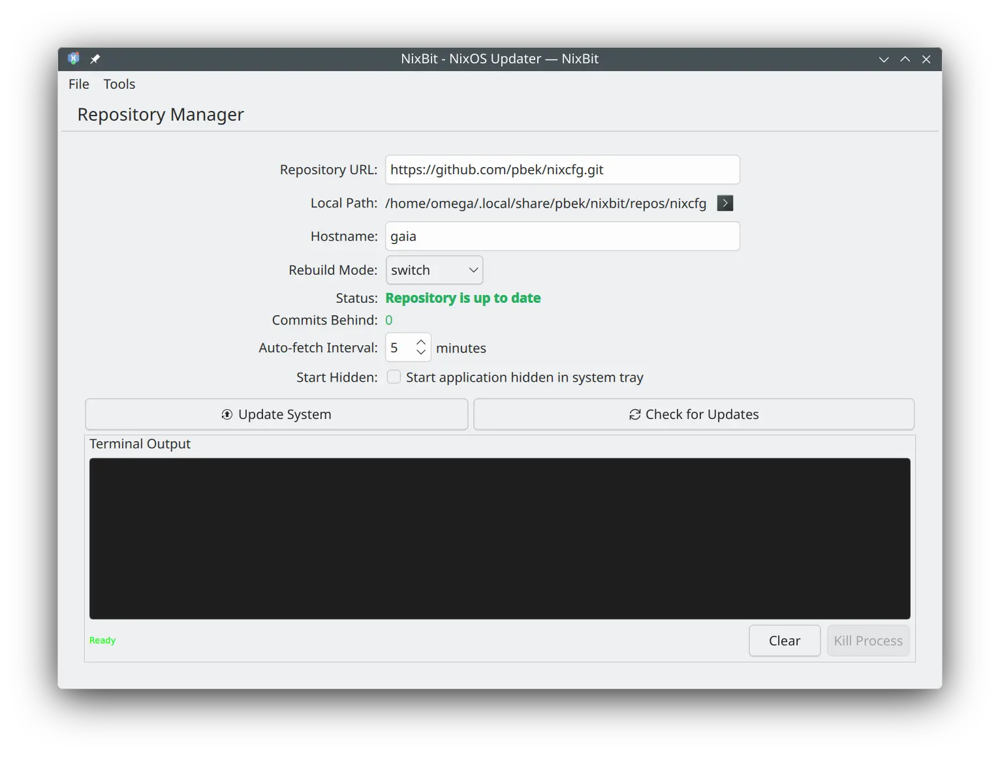

# [Nixbit](https://github.com/pbek/nixbit)

[Changelog](https://github.com/pbek/nixbit/blob/main/CHANGELOG.md) |
[Releases](https://github.com/pbek/nixbit/releases) |
[Issues](https://github.com/pbek/nixbit/issues)

[](https://github.com/pbek/nixbit/actions/workflows/build-nix.yml)

A **GUI application for updating your NixOS system** from a Nix Flakes Git repository.

You can try it out by running:

```bash
nix run github:pbek/nixbit
```

> [!TIP]
> If Qt complains about different minor versions, you can try using your own nixpkgs:
>
> ```bash
> nix run github:pbek/nixbit --override-input nixpkgs nixpkgs
> ```



There also is a **NixOS Module** to allow the configuration of the Git repository,
so you can preset it for all systems in your fleet.

## NixOS Module

The flake includes a NixOS module to configure nixbit system-wide.
This allows you to manage Nixbit configuration declaratively in your NixOS configuration.

### Basic Usage

```nix
# In your flake.nix inputs
inputs.nixbit.url = "github:pbek/nixbit";
inputs.nixbit.inputs.nixpkgs.follows = "nixpkgs";

# In your NixOS configuration
{
  imports = [ inputs.nixbit.nixosModules.nixbit ];

  nixbit = {
    enable = true;
    repository = "https://github.com/youruser/nixcfg.git";
  };
}
```

### Module Options

The module provides the following configuration options:

#### `nixbit.enable`

- **Type**: `boolean`
- **Default**: `false`
- **Description**: Enables the Nixbit module. When enabled, the package will be installed system-wide and configuration will be written to `/etc/nixbit.conf`.

#### `nixbit.package`

- **Type**: `package`
- **Default**: `pkgs.callPackage ./package.nix { }`
- **Description**: The Nixbit package to install. This allows you to override the default package if you want to use a custom build or different version.

#### `nixbit.repository`

- **Type**: `string`
- **Required**: Yes
- **Description**: The Git repository URL that Nixbit will use for system updates. This URL will be written to `/etc/nixbit.conf` and cannot be changed by users through the UI, ensuring consistent configuration across your fleet. Example: `"https://github.com/youruser/nixcfg.git"`

#### `nixbit.forceAutostart`

- **Type**: `boolean`
- **Default**: `false`
- **Description**: When enabled, forces the creation of an autostart desktop entry every time the application starts. This is useful for ensuring Nixbit starts automatically on all systems in your fleet, regardless of user preferences. The setting is written to `/etc/nixbit.conf`.

### What the Module Does

When the module is enabled, it:

1. **Installs the package**: Adds the Nixbit package to `environment.systemPackages`, making it available system-wide
2. **Creates configuration file**: Generates `/etc/nixbit.conf` with:
   - The specified repository URL (in the `[Repository]` section with `Url` key)
   - The autostart force setting (in the `[Autostart]` section with `Force` key)
3. **Locks settings**: Any settings written to `/etc/nixbit.conf` cannot be modified through the Nixbit UI, ensuring your fleet configuration remains consistent

## Features

### 🔄 NixOS Generations

- **Current Generation Display**: Shows current generation number and date in main UI (hides during builds)
- **Generation History**: "View All Generations" button opens a dialog with complete generation history
- **Generation Management**: Manual refresh capability and automatic refresh after "switch" operations
- **Visual Indicators**: Generation list highlights the current generation for easy identification

### 📦 Repository Management

- **Repository URL Configuration**: Input field for Git repository URLs with confirmation dialog for changes
- **Local Repository Management**: Display local path, delete repository with safety checks and confirmation, open terminal in repository directory
- **Status Monitoring**: Real-time display of repository status, commits behind, and busy indicators
- **Auto-fetch Interval**: Configurable automatic fetch interval in minutes
- **Network Resilience**: Waits for network availability after system resume before checking for updates

### 🚀 System Update

- **Hostname Configuration**: Input field for NixOS system hostname
- **Rebuild Mode Selection**: Choose between 'build' (no activation) and 'switch' (build and activate) modes with descriptive explanations
- **Build Host Management**: Configure multiple build hosts with friendly names and SSH addresses
- **Build Host Selection**: Choose between local or remote build hosts for each rebuild mode independently
- **Update System**: One-click button to pull repository updates and rebuild the system
- **Check for Updates**: Button to manually check for repository updates
- **Process Control**: Pause and resume system update processes during builds

### 📊 System Monitoring

- **CPU Usage**: Real-time CPU utilization display during builds
- **Memory Usage**: Current RAM usage with used/available memory information
- **Network Transfer**: Upload and download rates during system updates
- **Disk I/O**: Read/write rates for all physical disks (NVMe, SATA, SCSI, virtio, IDE, MMC/SD)
- **System Load**: Current system load average monitoring

### 🎨 User Interface

- **Modern KDE Integration**: Built with Kirigami for native KDE Plasma look and feel
- **Menu Bar**: File menu with Quit option, Tools menu with Check for Updates
- **Action Buttons**: Quick access to system update and update check operations
- **Terminal Output Panel**: Real-time command output display with clear and kill process buttons
- **Progress Indicators**: Progress bar for cloning operations and busy indicators for ongoing tasks
- **System Tray Support**: Option to start the application hidden in the system tray
- **Autostart Option**: Checkbox to create or remove autostart desktop entry
- **Settings Dialog**: Dedicated dialog for configuring build hosts, autostart, and other settings
- **Confirmation Dialogs**: Safety prompts for deleting repositories and changing URLs
- **Status Notifications**: Inline messages for operation results and errors
- **Window State Persistence**: Window size and position remembered across sessions
- **Debug Mode**: `--debug` CLI argument for testing with separate settings directory

## 🛠️ Technology Stack

- **Language**: C++ (Qt6)
- **UI Framework**: QML with KDE Kirigami
- **Build System**: CMake 3.20+
- **Dependencies**:
  - Qt6 (Core, Gui, Qml, Quick, Widgets)
  - KDE Frameworks 6
  - KF6 Kirigami
  - Git (runtime dependency)

## 🔨 Building

### Prerequisites

This project uses `devenv` for a reproducible development environment with all necessary dependencies:

```bash
# Enter the development shell
devenv shell

# Or use direnv (if configured)
direnv allow
```

### Using Just Recipes

The project provides Just recipes for common build and development tasks:

```bash
# Configure the project with CMake
just build

# Run the application
just run

# Build the nix package
just nix-build

# Run the application from the nix package
just nix-run
```

## 📄 License

See [LICENSE.md](LICENSE.md) for details.

## 🤝 Contributing

This is an early-stage project. Contributions are welcome!

---

Built with ❤️ for the NixOS community
