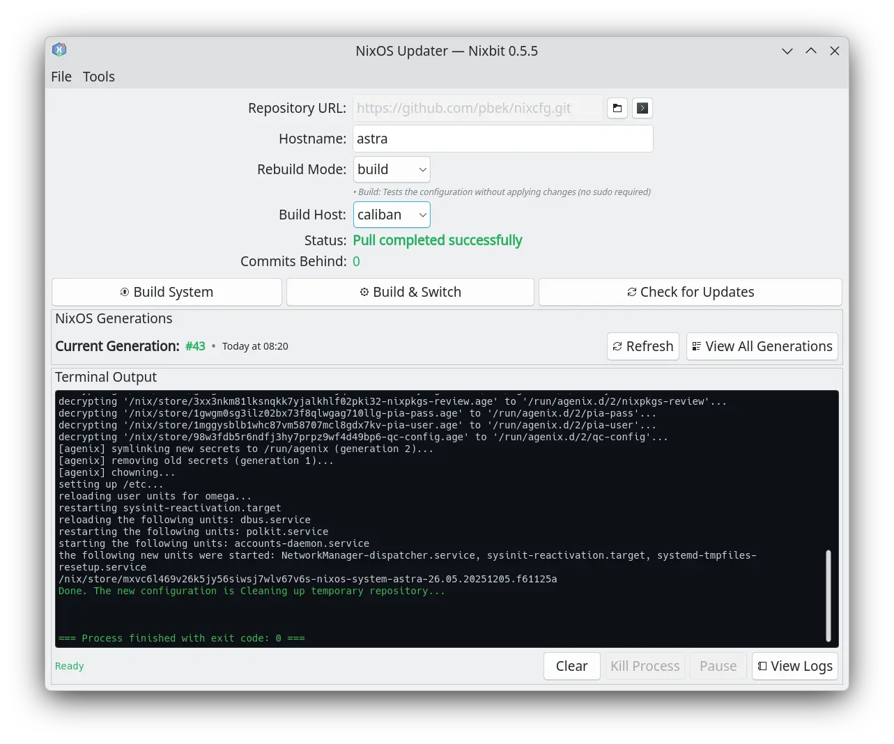

# [Nixbit](https://github.com/pbek/nixbit)

[Changelog](https://github.com/pbek/nixbit/blob/main/CHANGELOG.md) |
[Releases](https://github.com/pbek/nixbit/releases) |
[Issues](https://github.com/pbek/nixbit/issues)

[](https://github.com/pbek/nixbit/actions/workflows/build-nix.yml)

A **GUI application for updating your NixOS system** from a Nix Flakes Git repository.

You can try it out by running:

```bash
nix run github:pbek/nixbit
```

> [!TIP]
> If Qt complains about different minor versions, you can try using your own nixpkgs:
>
> ```bash
> nix run github:pbek/nixbit --override-input nixpkgs nixpkgs
> ```



> [!NOTE]
> See more [screenshots](screenshots/README.md) showcasing the system monitor and settings dialog.

There also is a **NixOS Module** to allow the configuration of the Git repository,
so you can preset it for all systems in your fleet.

## NixOS Module

The flake includes a NixOS module to configure nixbit system-wide.
This allows you to manage Nixbit configuration declaratively in your NixOS configuration.

### Basic Usage

```nix
# In your flake.nix inputs
inputs.nixbit.url = "github:pbek/nixbit";
inputs.nixbit.inputs.nixpkgs.follows = "nixpkgs";

# In your NixOS configuration
{
  imports = [ inputs.nixbit.nixosModules.nixbit ];

  nixbit = {
    enable = true;
    repository = "https://github.com/youruser/nixcfg.git";
  };
}
```

### Module Options

The module provides the following configuration options:

#### `nixbit.enable`

- **Type**: `boolean`
- **Default**: `false`
- **Description**: Enables the Nixbit module. When enabled, the package will be installed system-wide and configuration will be written to `/etc/nixbit.conf`.

#### `nixbit.package`

- **Type**: `package`
- **Default**: `pkgs.callPackage ./package.nix { }`
- **Description**: The Nixbit package to install. This allows you to override the default package if you want to use a custom build or different version.

#### `nixbit.repository`

- **Type**: `string`
- **Required**: Yes
- **Description**: The Git repository URL that Nixbit will use for system updates. This URL will be written to `/etc/nixbit.conf` and cannot be changed by users through the UI, ensuring consistent configuration across your fleet. Example: `"https://github.com/youruser/nixcfg.git"`

#### `nixbit.forceAutostart`

- **Type**: `boolean`
- **Default**: `false`
- **Description**: When enabled, forces the creation of an autostart desktop entry every time the application starts. This is useful for ensuring Nixbit starts automatically on all systems in your fleet, regardless of user preferences. The setting is written to `/etc/nixbit.conf`.

### What the Module Does

When the module is enabled, it:

1. **Installs the package**: Adds the Nixbit package to `environment.systemPackages`, making it available system-wide
2. **Creates configuration file**: Generates `/etc/nixbit.conf` with:
   - The specified repository URL (in the `[Repository]` section with `Url` key)
   - The autostart force setting (in the `[Autostart]` section with `Force` key)
3. **Locks settings**: Any settings written to `/etc/nixbit.conf` cannot be modified through the Nixbit UI, ensuring your fleet configuration remains consistent

## Privilege Escalation (pkexec / sudo)

The `switch` and `boot` rebuild modes need root privileges. Nixbit resolves a
privilege escalation tool at run time:

1. It prefers a **setuid `pkexec`** (for example the NixOS wrapper at
   `/run/wrappers/bin/pkexec`), which shows a graphical authentication dialog.
2. If no setuid `pkexec` is available, it falls back to a **setuid `sudo`**,
   using a graphical askpass helper (such as `ksshaskpass`) when one is found.

### Enabling pkexec on NixOS

On NixOS, binaries in the Nix store cannot be setuid; a setuid **wrapper** must
be created instead. Enabling polkit alone is **not** enough — NixOS does not
create a setuid `pkexec` wrapper by default, so `pkexec` will fail with
`pkexec must be setuid root` and Nixbit will use the `sudo` fallback.

To use `pkexec`, declare the wrapper explicitly in your NixOS configuration:

```nix
{ pkgs, ... }:
{
  # Enable polkit and a polkit authentication agent for your desktop.
  # (KDE Plasma already runs polkit-kde-agent.)
  security.polkit.enable = true;

  # Create a setuid wrapper for pkexec, since NixOS does not ship one.
  security.wrappers.pkexec = {
    owner = "root";
    group = "root";
    setuid = true;
    source = "${pkgs.polkit.bin}/bin/pkexec";
  };
}
```

After `nixos-rebuild switch` (and re-login, or reboot), `/run/wrappers/bin/pkexec`
will exist as a setuid root binary, and Nixbit will automatically prefer it over
`sudo` — no Nixbit configuration change is required.

> [!NOTE]
> `pkexec` does not cache credentials the way `sudo` does, so it authenticates
> separately for each privileged action. The `sudo` fallback may reuse a cached
> credential within its timeout.

## Features

### 🔄 NixOS Generations

- **Current Generation Display**: Shows current generation number and date in main UI (hides during builds)
- **Generation History**: "View All Generations" button opens a dialog with complete generation history
- **Generation Management**: Manual refresh capability and automatic refresh after "switch" operations
- **Visual Indicators**: Generation list highlights the current generation for easy identification

### 📦 Repository Management

- **Repository URL Configuration**: Input field for Git repository URLs with confirmation dialog for changes
- **Local Repository Management**: Local path displayed in Settings Dialog, delete repository with safety checks and confirmation
- **Repository Quick Access**: "Open in file manager" and "Open terminal" buttons for direct access to repository folder (supports multiple terminal emulators: konsole, gnome-terminal, xfce4-terminal, alacritty, kitty, ghostty, xterm)
- **Status Monitoring**: Real-time display of repository status, commits behind, and busy indicators
- **Auto-fetch Interval**: Configurable automatic fetch interval in minutes
- **Network Resilience**: Waits for network availability after system resume before checking for updates (10-second timeout)
- **Smart Refresh**: Automatically checks for repository updates when window becomes visible or is unhidden
- **Commit History Viewer**: "View Commits" button displays all available updates with detailed information
  - Short SHA hash (7 characters, monospace font)
  - Commit author name and message
  - Relative time (e.g., "2 hours ago") and full timestamp
  - Clickable commit hashes for GitHub repositories (opens commit page in browser)
  - Manual refresh capability

### 🚀 System Update

- **Hostname Configuration**: Input field for NixOS system hostname with automatic sanitization
- **Rebuild Mode Selection**: Choose between 'build' (no activation) and 'switch' (build and activate) modes with descriptive explanations
- **Build Host Management**: Configure multiple build hosts with friendly names and SSH addresses in Settings Dialog
- **Build Host Selection**: Choose between local or remote build hosts for each rebuild mode independently
- **Dynamic Button Labels**: Main action button reflects selected mode ("Build System" or "Switch System")
- **Build & Switch**: Chain build and switch operations - builds remotely first, then switches locally if successful
- **Update System**: One-click button to pull repository updates and rebuild the system
- **Check for Updates**: Button to manually check for repository updates
- **Process Control**: Pause and resume system update processes during builds (hidden in switch mode due to sudo limitations)

### 📊 System Monitoring

- **CPU Usage**: Real-time CPU utilization display during builds
- **Memory Usage**: Current RAM usage with used/available memory information
- **Network Transfer**: Upload and download rates during system updates
- **Disk I/O**: Read/write rates for all physical disks (NVMe, SATA, SCSI, virtio, IDE, MMC/SD)
- **System Load**: Current system load average monitoring

### 🎨 User Interface

- **Modern KDE Integration**: Built with Kirigami for native KDE Plasma look and feel
- **Menu Bar**: File menu with Quit option, Tools menu with Check for Updates
- **Action Buttons**: Quick access to system update and update check operations
- **Terminal Output Panel**: Real-time command output display with syntax highlighting and interactive features
  - Success messages highlighted in green (e.g., "Done. The new configuration is", "Process finished with exit code: 0")
  - Error messages highlighted in red and bold (e.g., "error:", "failed", non-zero exit codes)
  - Warning messages highlighted in yellow/orange
  - Build activity messages highlighted in cyan (e.g., "building", "copying", "evaluating")
  - Process status markers highlighted in magenta and bold (e.g., "=== Process finished ===")
  - Text selection with mouse and keyboard (Ctrl+C to copy, Ctrl+A to select all)
  - Right-click context menu with Copy, Select All, and Deselect options
  - Output buffer limiting (last 5,000 lines by default, configurable 500-20,000) to prevent memory issues
  - Clear and kill process buttons
- **Build Logs Management**: "View Logs" button to access past build logs
  - Stores last 10 build logs by default (configurable 0-100, 0 = unlimited)
  - Shows timestamp, build type (BUILD/SWITCH), exit status, and file size
  - Open logs in default editor or delete with confirmation
  - Logs stored in `~/.local/share/nixbit/logs/` directory
- **Build Status Messages**: Clear feedback after builds
  - Green success message ("✓ Build completed successfully!") when exit code is 0
  - Red error message with exit code ("✗ Build failed with exit code N") when build fails
  - Messages persist until dismissed or next action
- **Progress Indicators**: Progress bar for cloning operations and busy indicators for ongoing tasks
- **System Tray Support**: Option to start the application hidden in the system tray
  - Tray icon reflects update status (up-to-date, updates available, unknown)
  - Debug mode uses different colors for easier identification (cyan, darker orange, purple)
- **Autostart Option**: Checkbox to create or remove autostart desktop entry
- **Settings Dialog**: KDE System Settings-style interface with vertical category menu
  - Categories: General, Performance, Repository, Build Hosts
  - Split-view layout (900x600) for better organization
  - Performance settings: Max Terminal Lines (500-20,000), Max Stored Logs (0-100)
  - Repository settings: Local path display with delete option
  - Build Hosts: Create, update, delete host configurations with inline editing
- **Confirmation Dialogs**: Safety prompts for deleting repositories and changing URLs
- **Status Notifications**: Inline messages for operation results and errors
- **Window State Persistence**: Window size and position remembered across sessions
- **Automatic Data Refresh**: When window becomes visible, automatically checks for repository updates and refreshes generations list
- **Debug Mode**: `--debug` CLI argument for testing with separate settings directory and default build mode

## 🛠️ Technology Stack

- **Language**: C++ (Qt6)
- **UI Framework**: QML with KDE Kirigami
- **Build System**: CMake 3.20+
- **Dependencies**:
  - Qt6 (Core, Gui, Qml, Quick, Widgets)
  - KDE Frameworks 6
  - KF6 Kirigami
  - Git (runtime dependency)

## 🔨 Building

### Prerequisites

This project uses `devenv` for a reproducible development environment with all necessary dependencies:

```bash
# Enter the development shell
devenv shell

# Or use direnv (if configured)
direnv allow
```

### Using Just Recipes

The project provides Just recipes for common build and development tasks:

```bash
# Configure the project with CMake
just build

# Run the application
just run

# Build the nix package
just nix-build

# Run the application from the nix package
just nix-run
```

## 📄 License

See [LICENSE.md](LICENSE.md) for details.

## 🤝 Contributing

This is an early-stage project. Contributions are welcome!

> [!NOTE]
> This project was developed with AI assistance.

---

Built with ❤️ for the NixOS community
