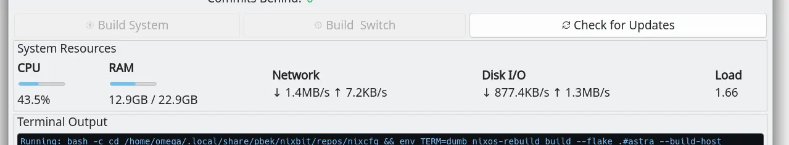
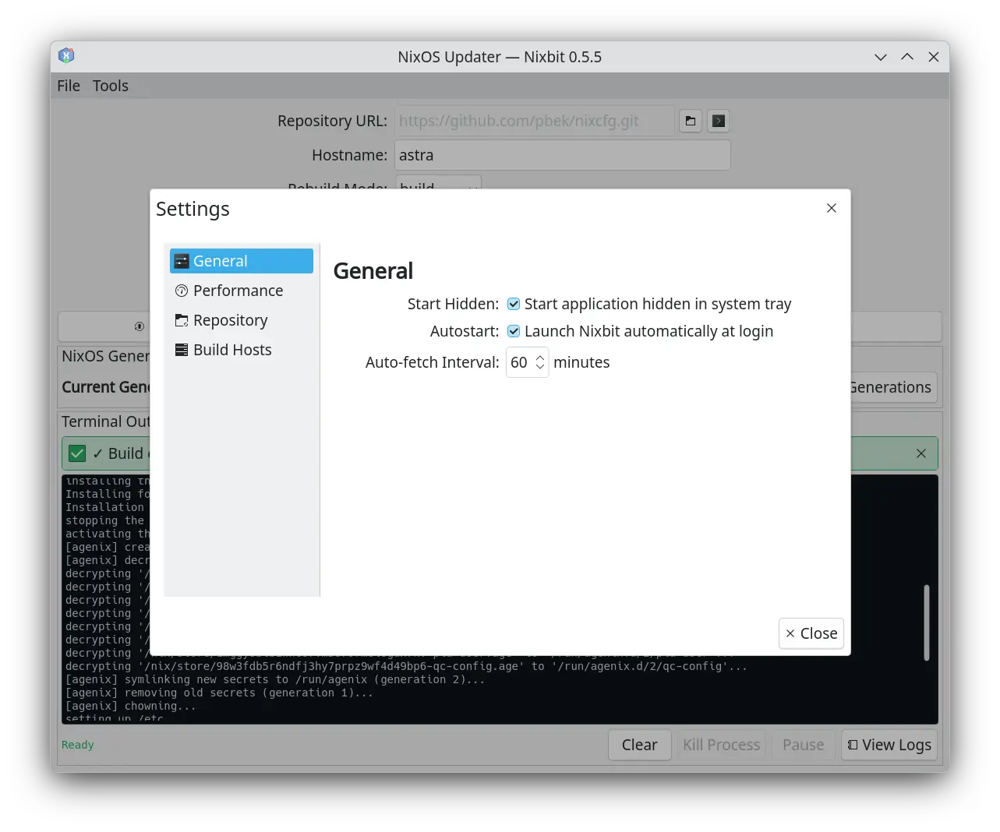

# Nixbit Screenshots

This directory contains screenshots showcasing the various features and interfaces of Nixbit.

## Main Window

The main window provides the primary interface for managing your NixOS system updates.

## System Monitor

Real-time monitoring of CPU, memory, network, and disk I/O during system builds.

## Settings Dialog

Configuration interface for build hosts, repository settings, and application preferences.

